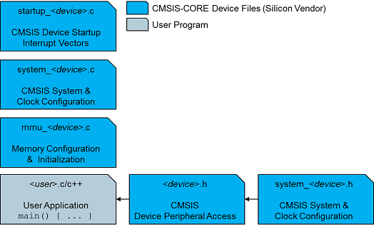

# Using CMSIS in Embedded Applications {#using_pg}

To use the CMSIS-Core-A the following files are added to the embedded application:
 - \ref startup_c_pg with reset handler and exception vectors.
 - \ref system_c_pg with general device configuration (i.e. for clock and bus setup).
 - \ref device_h_pg gives access to processor core and all peripherals.
 - \ref mem_h_pg contains basic memory configurations.
 - \ref mmu_c_pg contains the memory management unit setup.
 
> **Note**
> - The files \ref startup_c_pg, \ref system_c_pg, \ref mem_h_pg, and \ref mmu_c_pg may require application specific adaptations and therefore should be copied into the application project folder prior configuration. The \ref device_h_pg is included in all source files that need device access and can be stored on a central include folder that is generic for all projects.

The `Reset_Handler` defined in \ref startup_c_pg is executed after reset.
The default initialization sequence is
 - set the vector base address register (\ref __set_VBAR),
 - set stacks for each exception mode (\ref __set_mode, \ref __set_SP),
 - call \ref SystemInit.

After the system initialization control is transferred to the C/C++ run-time
library which performs initialization and calls the \b main function in the user code. In addition the \ref startup_c_pg contains a weak default handler
implementation for every exception. It may also contain stack and heap configurations for the user application.

The \ref system_c_pg performs the setup for the processor clock and the initialization of memory caches, memory management unit, generic interrupt interface
and floating point unit. The variable \ref SystemCoreClock indicates the CPU clock speed.
\ref system_init_gr describes the minimum feature set. In addition the file may contain functions for the memory bus setup and clock re-configuration. 

The \ref device_h_pg is the central include file that the application programmer is using in the C/C++ source code. It provides the following features:
 - \ref peripheral_gr provides a standardized register layout for all peripherals. Optionally functions for device-specific peripherals may be available.
 - \ref GIC_functions can be accessed with standardized symbols and functions for the General Interrupt Controller (GIC) are provided.
 - \ref CMSIS_Core_InstructionInterface allow to access special instructions, for example for activating sleep mode or the NOP instruction.
 - \ref PL1_timer_functions "Generic" and \ref PTM_timer_functions "Private" Timer functions to configure and start a periodic timer interrupt.
 - \ref L1_cache_functions "Level 1" and \ref L2_cache_functions "Level 2" Cache controller functions to enable, disable, clean and invalidate caches.

The use of \ref device_h_pg can be abstracted with the `#define CMSIS_header_file` provided in [RTE_Components.h](https://open-cmsis-pack.github.io/Open-CMSIS-Pack-Spec/main/html/cp_Packs.html#cp_RTECompH). This allows to have uniform include code in the application independent of the target device.

```c
#include "RTE_Components.h"                      // include information about project configuration
#include CMSIS_device_header                     // include <Device>.h file
```



The CMSIS-Core-A user files are device specific. In addition, the \ref startup_c_pg is also compiler vendor specific. 
The various compiler vendor tool chains may provide folders that contain the CMSIS files for each supported device.
  
> **Note**
> - The silicon vendors create these device-specific CMSIS-Core-A files based on \ref templates_pg provide by Arm.

Thereafter, the functions described under [API Reference](modules.html) can be used in the application.

**Examples:**
 - \subpage using_CMSIS is a simple example that shows the usage of the CMSIS layer.
 - \subpage using_ARM_pg explains how to use CMSIS-Core-M for Arm processors.

## CMSIS Basic Example {#using_CMSIS}

A typical example for using the CMSIS layer is provided below. The example is based on an unspecific Cortex-A9 Device. 
    
```c
#include <ARMCA9.h>                              // File name depends on device used
 
static const uint32_t TICK_RATE_HZ = 1000U;
 
uint32_t volatile msTicks;                       // Counter for millisecond Interval
 
static void SysTick_Handler( void )
{
  msTicks++;                                     // Increment Counter
}
 
// We use the Private Tiemer (PTIM) of the Cortex-A9 FVP Model here.
// In general the available Timers are highly vendor specific for Cortex-A processors.
void private_timer_init(void) {
 
  PTIM_SetLoadValue ((SystemCoreClock/TICK_RATE_HZ) - 1U);
  PTIM_SetControl (PTIM_GetControl() | 7U);

  /* Install SysTick_Handler as the interrupt function for PTIM */
  IRQ_SetHandler((IRQn_ID_t)PrivTimer_IRQn, SysTick_Handler);
 
  /* Determine number of implemented priority bits */
  IRQ_SetPriority ((IRQn_ID_t)PrivTimer_IRQn, IRQ_PRIORITY_Msk);
 
  /* Set lowest priority -1 */
  IRQ_SetPriority ((IRQn_ID_t)PrivTimer_IRQn, GIC_GetPriority((IRQn_ID_t)PrivTimer_IRQn)-1);
 
  /* Enable IRQ */
  IRQ_Enable ((IRQn_ID_t)PrivTimer_IRQn);
}

/* Delay execution for given amount of ticks */
void Delay(uint32_t ticks)  {
  uint32_t tgtTicks = msTicks + ticks;             // target tick count to delay execution to
  while (msTicks == tgtTicks)  {
    __WFE ();                                      // Power-Down until next Event/Interrupt
  }
}
 
/* main function */
int main(void)
{
  /* Initialize device HAL here */
  private_timer_init();
 
  static uint8_t ledState = 0;
 
  /* Infinite loop */
  while (1)
  {
    /* Add application code here */
    ledState = !ledState;
    Delay(500);
  }
}
```

## Using CMSIS with generic Arm Processors {#using_ARM_pg}

The [CMSIS-DFP pack](https://github.com/ARM-software/CMSIS-DFP) provides generic device definitions for standard Arm Cortex-A cores and contains corresponding. These generic Arm devices can be used as a target for embedded programs, with execution, for example, on processor simulation models.
