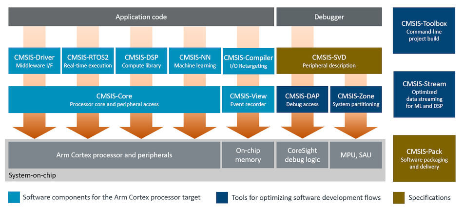
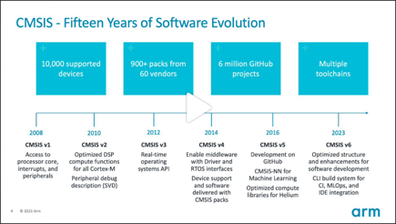

# Introduction {#mainpage}

The **CMSIS** (Common Microcontroller Software Interface Standard) is a set of APIs, software components, tools, and workflows that help to simplify software re-use, reduce the learning curve for microcontroller developers, speed-up project build and debug, and thus reduce the time to market for new applications.

## CMSIS Components {#cmsis_components}

## CMSIS v6 Introduction Webinar

Watch the [introduction webinar](https://on-demand.arm.com/flow/arm/devhub/sessionCatalog/page/pubSessCatalog/session/1705915235972001vEdN) to learn about CMSIS v6 amd how to use it.

## Related CMSIS-Packs

The following CMSIS v6 components are available as CMSIS-Packs that you can use in your next embedded project:

- [CMSIS-Compiler](https://www.keil.arm.com/packs/cmsis-compiler-arm): Retarget I/O functions of the standard C run-time library.
- [CMSIS-DSP](https://www.keil.arm.com/packs/cmsis-dsp-arm/): Optimized compute functions for embedded systems.
- [CMSIS-NN](https://www.keil.arm.com/packs/cmsis-nn-arm): Efficient and performant neural network kernels.
- [CMSIS-RTX](https://www.keil.arm.com/packs/cmsis-rtx-arm): Keil RTX5, a CMSIS-RTOS2 API compliant real-time operating system.
- [CMSIS-View](https://www.keil.arm.com/packs/cmsis-view-arm): Event Recorder and Component Viewer technology.
- [MDK-Middleware](https://www.keil.arm.com/packs/mdk-middleware-keil): File system, network, and USB stacks.
